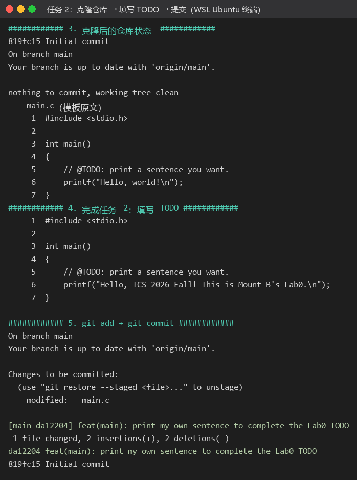
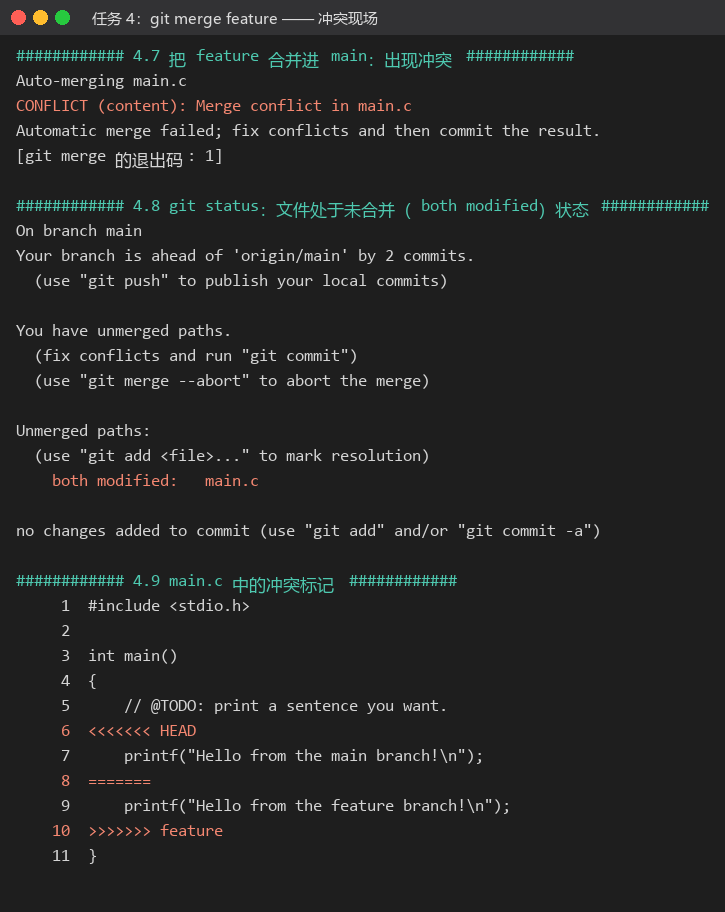
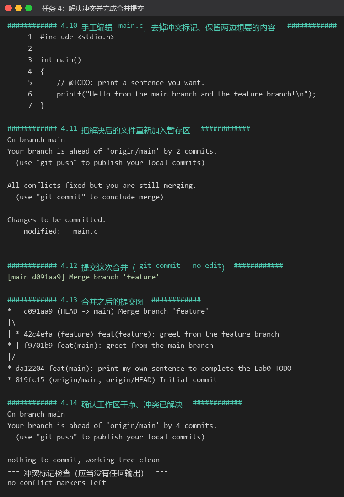
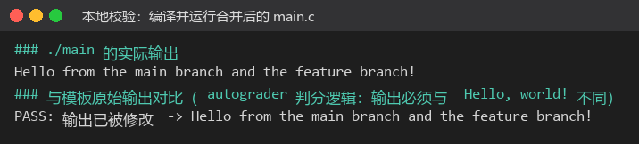

<!-- 说明：报告中的「学号」与第二节 2.1「多人协同开发经历」请按本人真实情况填写 / 核对。 -->

# 计算机系统基础（2026 年秋季学期）Lab0：GitLab 实验报告

| 项目 | 内容 |
| --- | --- |
| 姓名 / GitHub 账号 | Mount-B |
| 学号 | <!-- 请填写学号 --> |
| 个人仓库 | <https://github.com/Mount-B/TestLab> |
| 实验日期 | 2026 年 10 月 9 日 |
| 实验环境 | Windows 11（10.0.26100）+ WSL2 Ubuntu 26.04.1 LTS（内核 6.18.40.1-microsoft-standard-WSL2）<br>git 2.53.0（WSL）、git 2.52.0（Windows）、MinGW-w64 gcc 16.2.0（本地编译校验） |
| 报告中的截图 | 均为实验过程中真实终端会话记录（`script` 记录）的渲染图，命令与输出未经改写 |

---

## 一、实验任务完成情况

| 任务 | 分值 | 完成情况 |
| --- | --- | --- |
| 任务 1：阅读文档，回答文档中的问题 | 15 | 见本文第二节 |
| 任务 2：用模板仓库建立个人仓库，补全 `main.c` 的 `TODO` 并提交 | 50 | 见 3.2 节，提交 `da12204` |
| 任务 3：任选两篇网页阅读并概括，谈「为什么要学习 Git」 | 15 | 见本文第四节（选读 Commit Message 规范、语义化版本） |
| 任务 4：新建 `feature` 分支，两个分支各改一次 `main.c` 并提交，合并时制造并解决冲突 | 10 + 10 | 见 3.3 节，提交 `42c4efa`、`f9701b9`、合并提交 `d091aa9` |
| 任务 5：在 `main` 分支提交实验报告（Markdown） | 单独评分 | 本文件 `report.md` |

最终提交历史（`main` 分支）：

```text
*   d091aa9 Merge branch 'feature'
|\
| * 42c4efa feat(feature): greet from the feature branch
* | f9701b9 feat(main): greet from the main branch
|/
* da12204 feat(main): print my own sentence to complete the Lab0 TODO
* 819fc15 Initial commit
```

---

## 二、文档中要求回答的问题

### 2.1 你之前有过多人协同开发的经历吗？如果有，你们是使用什么方式分工协作的？

有过，主要是课程小组项目（课设 / 大作业）和几次需要多人一起整理代码的比赛。我们的协作方式大致经历了三个阶段：

**（1）"分工—互传压缩包"的原始阶段。** 把项目按模块拆开，每人负责一两个文件，约定好函数接口后用聊天软件互发压缩包，最后指定一个人手工合并。问题很明显：接口一旦改动，别人手里的副本就过期了；合并只能靠人眼比对，经常出现"最后一次覆盖把别人的修改弄丢"的事故，回退也没有任何依据。

**（2）GitHub 仓库 + 分支 + Pull Request 阶段。** 后来我们约定：`main` 分支始终保持可运行，每个人的开发都从 `main` 切出 `feature/<名字>` 分支，完成一个完整的小功能就 `git commit` 并 `git push`，然后在 GitHub 上开 Pull Request，由负责该模块的同学 review 之后再合并。冲突大多出现在公共文件（头文件、`Makefile`、主程序）上，我们就对着 `git merge` 生成的冲突标记一行行协商，改完 `git add` + `git commit --continue` 完成合并。这个阶段最大的变化是"改动有据可查"：谁的、什么时候、为什么改的，都在提交历史里。

**（3）Issue / 看板驱动的阶段。** 现在会把任务拆成 Issue 分配到人，提交信息也按 `feat` / `fix` / `docs` 之类的前缀写，方便回溯和生成变更说明。

体会：多人协作真正的难点不在 Git 命令本身，而在于"约定"——用什么分支模型、提交粒度多大、谁有权合并。Git 的作用是把这些约定固化成可执行的流程（分支、PR、review、CI），而不是靠记忆和口头承诺。

### 2.2 思考一下，Git 为什么要设计"暂存-提交"两个步骤？

我认为这不是多余的一步，而是 Git 把"我要提交什么"和"我要记录这次提交"两件事拆开，带来四点好处：

1. **提交的原子性与可控性。** 工作区里常常同时存在多个目的不同的改动（修 bug、调格式、加功能）。`git add <file>`、尤其是 `git add -p` 逐块暂存，让我们可以只把"属于这一件事"的改动放进暂存区，写出一条只做一件事的提交。历史干净，回滚（`git revert` / `git bisect`）才有意义——否则一次提交里混了五件事，回退任何一件都要牵连其他。
2. **提交前可以复核和反悔。** 暂存区是"下一次提交的快照"，`git diff --cached` 能在真正写入历史之前看到"我到底要提交什么"，`git restore --staged` 可以随时把文件从暂存区拿回来。用文档里的话说，就是先放进购物车、确认无误再下单，而不是直接下单。
3. **提高安全性。** 未暂存的改动不会进入提交，避免把调试代码、临时文件、密钥误提交。工作区里的实验性修改可以一直留着不提交，或者用 `git stash` 收起来，不影响下一次干净提交。
4. **它是很多进阶功能的基础。** `git commit --amend`（把漏掉的内容补进上一次提交）、`git stash`、合并/变基时"用 `git add` 标记冲突已解决"、部分检出等等，都建立在"工作区 — 暂存区（index） — 版本库"这三层结构上。**简单说：暂存区把 Git 从"保存文件"变成了"编辑历史"，让我们能够主动设计提交的粒度，而不是被动接受工作区的当前状态。**

### 2.3 `git branch` 和 `git branch -a` 的区别是什么？

- `git branch` 只列出**本地分支**（对应 `refs/heads/*`），当前所在分支前面有一个 `*` 号。
- `git branch -a`（即 `--all`）列出**本地分支 + 远程跟踪分支**，远程分支以 `remotes/origin/xxx` 的形式显示（对应 `refs/remotes/*`）；如果仓库里有多个 worktree，它还会标出被其他 worktree 检出的分支。相关的还有 `git branch -r`，只列远程跟踪分支。

差别来自 Git 的引用命名空间：本地分支和远程跟踪分支是两套引用，`git branch` 默认只看前者。二者的用途也不同：`git branch` 用来确认"我现在有哪些本地分支、在哪个分支上"；`git branch -a` 用来确认"远端有哪些分支"，从而决定要不要先 `git fetch`、`git switch <branch>`（Git 会依据远程跟踪分支自动创建同名的本地跟踪分支）或发起 Pull Request。需要注意的是，**`-a` 列出的远程分支是"上次 fetch 时的快照"**，并不代表远端的实时状态，想看最新情况要先 `git fetch`（或 `git fetch --prune` 清理已删除的远程分支）。

---

## 三、实验步骤与截图

### 3.1 环境准备与仓库克隆

按照文档提示，本实验的 Git 操作在 WSL（Ubuntu）中完成：Windows 侧只用来编辑报告、做本地编译校验。先确认身份配置与 SSH 认证：

```bash
git config --global user.name      # Mount-B
git config --global user.email     # mtb82828690@qq.com
ssh -T git@github.com              # Hi Mount-B! You've successfully authenticated...
git clone git@github.com:Mount-B/TestLab.git
```

个人仓库 `Mount-B/TestLab` 由课程模板仓库 [ICS-26Fall-FDU/GitLab](https://github.com/ICS-26Fall-FDU/GitLab) 通过 `Use this template → Create a new repository` 生成，初始只有一个 `Initial commit`（`819fc15`），包含 `main.c`、`Makefile`、`README.md` 与 `.github/workflows/classroom.yml`。

### 3.2 任务 2：补全 `main.c` 中的 `TODO` 并提交

模板中 `main.c` 的第 6 行就是需要完成的 `TODO`：把 `printf` 的字符串换成自己想打印的内容（这一点很关键，仓库自带的 autograder 判断标准正是"程序输出与原来的 `Hello, world!` 不同"）。

```bash
git add main.c
git commit -m "feat(main): print my own sentence to complete the Lab0 TODO"
# [main da12204] feat(main): print my own sentence to complete the Lab0 TODO
```



*图 1：任务 2 的完整终端记录——克隆后的仓库状态、模板原文、修改后的 `main.c` 与首次提交。*

### 3.3 任务 4：分支管理与合并冲突

**（1）冲突是怎么被"制造"出来的。** 文档中提到 `git merge` 的冲突条件是"两个分支修改了同一文件的同一位置"。因此我让 `feature` 分支和 `main` 分支**修改 `main.c` 的第 6 行（同一个 `printf` 语句）**，这样两个分支从共同祖先 `da12204` 出发各自改写了同一行，Git 的三方合并（base / ours / theirs）无法自动决定取舍，必然产生冲突。

```bash
git switch -c feature         # 从 main 创建并切换到 feature 分支
# 修改第 6 行为 printf("Hello from the feature branch!\n");
git add main.c && git commit -m "feat(feature): greet from the feature branch"   # 42c4efa

git switch main               # 切回 main
# 修改第 6 行为 printf("Hello from the main branch!\n");
git add main.c && git commit -m "feat(main): greet from the main branch"         # f9701b9

git merge feature             # 冲突出现
```

**（2）冲突现场。** `git merge feature` 的输出是：

```text
Auto-merging main.c
CONFLICT (content): Merge conflict in main.c
Automatic merge failed; fix conflicts and then commit the result.
```

此时 `git status` 显示 `Unmerged paths: both modified: main.c`，`main.c` 中被写入了冲突标记：

```c
<<<<<<< HEAD
    printf("Hello from the main branch!\n");
=======
    printf("Hello from the feature branch!\n");
>>>>>>> feature
```



*图 2：冲突截图——`CONFLICT (content): Merge conflict in main.c`、`both modified` 状态与文件中的 `<<<<<<< / ======= / >>>>>>>` 冲突标记。*

**（3）解决冲突。** 解决思路是：先读懂两个分支各自的意图（都只是想打印一句话），删掉 `<<<<<<<`、`=======`、`>>>>>>>` 三个标记行，保留双方想要的内容并把两句话合并成一句，然后 `git add main.c` 把文件标记为"冲突已解决"，再 `git commit` 完成这次合并提交。

```c
    printf("Hello from the main branch and the feature branch!\n");
```

```bash
git add main.c
git status                    # All conflicts fixed but you are still merging.
git commit --no-edit          # [main d091aa9] Merge branch 'feature'
```

合并后的提交图证明 `feature` 上的提交已经并回 `main`：

```text
*   d091aa9 (HEAD -> main) Merge branch 'feature'
|\
| * 42c4efa (feature) feat(feature): greet from the feature branch
* | f9701b9 feat(main): greet from the main branch
|/
* da12204 feat(main): print my own sentence to complete the Lab0 TODO
```



*图 3：解决冲突的截图——编辑后的 `main.c`、`All conflicts fixed but you are still merging.`、合并提交 `d091aa9` 以及 `git log --graph` 的提交树；最后用 `grep` 确认文件中不再残留任何冲突标记。*

### 3.4 本地编译运行校验

在推送前，用本地编译器验证合并后的程序能编译且输出确实被修改过：

```text
$ gcc -Wall -O2 -o main.exe main.c
$ ./main.exe
Hello from the main branch and the feature branch!
```

与模板原始的 `Hello, world!` 比较结果为 **PASS**（这正是仓库中 autograder 的判分逻辑）。



*图 4：编译无警告，输出与模板原始输出不同，满足 autograder 的判分条件。*

### 3.5 推送到 GitHub

```bash
git push origin main
```

推送后本地 `main` 与 `origin/main` 同步，GitHub Actions 中的 `Autograding Tests` 工作流会在每次 push 时自动运行。**提交入口：** 按文档要求，将个人仓库链接 <https://github.com/Mount-B/TestLab> 提交到 E-Learning 平台。

---

## 四、任务 3：两篇文章的阅读概括与"为什么要学习 Git"

### 4.1 《Commit message 和 Change log 编写指南》（阮一峰）

**内容概括：**

- **为什么需要规范：** 格式化的提交信息能提供更多历史信息、便于按类型过滤查找（`git log --grep feature`），并且可以直接用工具自动生成 Change Log（发布新版本时说明与上一版的差异）。
- **格式：** 一次提交由 Header、Body、Footer 三部分组成，中间各空一行，任意一行不超过 72（100）个字符：
  - Header：`<type>(<scope>): <subject>`，其中 `type` 只能是 `feat`（新功能）、`fix`（修 bug）、`docs`（文档）、`style`（格式）、`refactor`（重构）、`test`（测试）、`chore`（构建/工具）七种；`feat` 与 `fix` 一定会进入 Change Log。`subject` 要求动词开头、第一人称现在时、首字母小写、结尾不加句号、不超过 50 字符。
  - Body：详细描述改动，重点是说明**动机**以及与旧行为的对比。
  - Footer：只用于两种情况——不兼容改动（以 `BREAKING CHANGE:` 开头）和关闭 Issue（`Closes #234`）；撤销某次提交时用 `revert:` 开头并写明 `This reverts commit <hash>.`。
- **工具链：** Commitizen（`git cz` 交互式生成合格信息）、validate-commit-msg（作为 `commit-msg` 钩子自动校验）、conventional-changelog（依据规范自动生成 CHANGELOG）。

**我的收获：** 提交信息是写给"未来的自己和协作者"的文档。规范化的价值不只是好看，而是让历史变成**可被机器消费的数据**：能自动生成变更日志、能按类型统计、能配合语义化版本号形成"提交 → 变更日志 → 版本号"的可追溯链条。我在本实验中也按这个规范写了提交信息（`feat(main): ...`）。

### 4.2 《语义化版本 2.0.0》（SemVer）

**内容概括：**

- 版本号必须采用 `X.Y.Z`（主版本号.次版本号.修订号）格式，禁止前导零，且要求软件有明确的**公共 API**。
- 递增规则：
  - **修订号 Z**：只做了向下兼容的问题修正时递增；
  - **次版本号 Y**：出现向下兼容的新功能（或弃用某个 API）时递增，同时修订号归零；
  - **主版本号 X**：出现不兼容的 API 修改时递增，同时次版本号与修订号归零。
- `0.y.z` 是初始开发阶段，API 随时可能变；`1.0.0` 标志着公共 API 的成形。**已发布的版本内容不得再修改**，任何改动都必须以新版本发布。
- 可以在版本号后追加先行版本号（`1.0.0-alpha.1`）和构建元信息（`1.0.0+20130313144700`，比较优先级时忽略）。优先级比较：主、次、修订号按数值比较，先行版本号的优先级低于对应正式版本（`1.0.0-alpha < 1.0.0-alpha.1 < 1.0.0-beta.2 < 1.0.0-rc.1 < 1.0.0`），数字标识符的优先级低于字母标识符。
- **目的：** 解决"依赖地狱"——当版本号本身携带了兼容性信息，依赖声明（如 `>=3.1.0 <4.0.0`）才真正有意义，包的升级才不会被迫锁死或陷入混乱。

**我的收获：** 版本号不是给市场看的数字，而是**关于接口兼容性的契约**。它和 4.1 的提交规范是同一套思想的延伸：让"改动的影响范围"通过格式化的约定被机器和人都读懂。文档开头提到的"校园 App 打版本号"的例子也让我意识到，日常使用的软件版本号背后就是这套规则。

### 4.3 我对"为什么要学习 Git"的理解

1. **它是当今软件开发的基础设施，而不是一个可选工具。** 开源项目、企业内部代码库、课程实验与 CI/CD 流水线几乎都以 Git 为载体；不会 Git，就等于无法参与绝大多数真实项目的协作。
2. **它给了我"敢于修改"的底气。** 版本控制能记录每一次变化、随时回退、随时对比。文档开头那个"把 `vector` 换成 `unordered_map` 又后悔"的例子正是没有版本控制时的真实痛点：没有安全网，人就不敢重构，代码只能越来越僵。
3. **它把协作从"互相迁就"变成"可以并行的工程流程"。** 分支让每个人可以独立开发，合并与冲突解决让分歧被显式地摆到台面上处理，Pull Request + review 让代码质量有制度保障；提交历史还回答"这段代码为什么是这样"这个注释往往回答不了的问题。
4. **它是一种通用的工程素养训练。** 学会 Git 的过程，其实是在训练"把一次改动讲清楚""把一件事拆成一次提交""用约定而不是用记忆来协作"这些能力——写实验报告、写论文、做项目管理都受益。
5. **对本课程而言，它是后续所有 Lab 的入口。** 从 Lab0 到之后的数据实验，提交与评分都依赖 Git/GitHub 流程；现在把 `clone → 修改 → add → commit → push → PR` 这条链路练熟，后面的实验就能把精力集中在真正的问题上。

---

## 五、实验建议

1. **在文档「实验任务」处附一份最短路径清单。** 文档信息量很大（对新手很友好），但第一次做实验时容易迷失。建议在任务列表后面直接给出一段可复制的命令序列（`clone → 改 TODO → commit → 建 feature 分支 → 两边各改一行 → merge → 解决冲突 → 写报告 → push`），把"必须做的事"和"拓展阅读"分开。
2. **明确提示"必须修改 `printf` 的内容"。** autograder 的判分点是"程序输出必须与 `Hello, world!` 不同"，但 `TODO` 注释只是说"print a sentence you want"，如果同学只是在文件里加注释、没有改字符串，就会被判 FAIL。建议在任务 2 的提示中写清这一点，或者在模板仓库里提供一个 `make check` 之类的本地自检脚本。
3. **提示跨 Windows / WSL 开发的两个坑。** 其一，SSH 密钥是在哪个环境里生成的，`git push` 就必须在哪个环境里执行（本机上同时装有 Windows Git 和 WSL Git 时特别容易混淆，建议统一在 WSL 里做实验）；其二，行尾（CRLF/LF）与 `core.autocrlf` 的差异会让模板文件出现"整文件都被修改"的假象，建议在文档里加一句提示。
4. **关于"必须制造冲突"这一点，建议直接给出最小示例。** 文档要求"两个分支的提交必须在合并时产生冲突"，并让同学自己思考怎么写才会冲突。可以直接点明"两个分支都修改文件的同一行"，同时提醒 `git merge --abort` 可以放弃这次合并、重来一次，降低试错成本。
5. **可以为报告模板提供骨架。** 例如给出"问题回答 / 实验步骤 / 截图 / 建议"四段式的空白 Markdown 模板，能减少格式上的返工，也让评分标准更直观。

---

## 附录 A：本实验使用的关键命令

```bash
# 环境与准备
git config --global user.name "Mount-B"
git config --global user.email "mtb82828690@qq.com"
ssh -T git@github.com
git clone git@github.com:Mount-B/TestLab.git

# 任务 2：完成 TODO 并提交
git add main.c
git commit -m "feat(main): print my own sentence to complete the Lab0 TODO"

# 任务 4：分支、制造冲突、解决冲突
git switch -c feature
git add main.c && git commit -m "feat(feature): greet from the feature branch"
git switch main
git add main.c && git commit -m "feat(main): greet from the main branch"
git merge feature                     # CONFLICT (content): Merge conflict in main.c
# 编辑 main.c，删除 <<<<<<< / ======= / >>>>>>> 并保留想要的内容
git add main.c
git commit --no-edit                  # Merge branch 'feature'
git log --oneline --graph --decorate --all

# 校验与提交实验报告
make && ./main && make clean
git add report.md assets/
git commit -m "docs(report): add the Lab0 experiment report"
git push origin main
```

## 附录 B：提交历史

```text
d091aa9 Merge branch 'feature'
42c4efa feat(feature): greet from the feature branch
f9701b9 feat(main): greet from the main branch
da12204 feat(main): print my own sentence to complete the Lab0 TODO
819fc15 Initial commit
```
